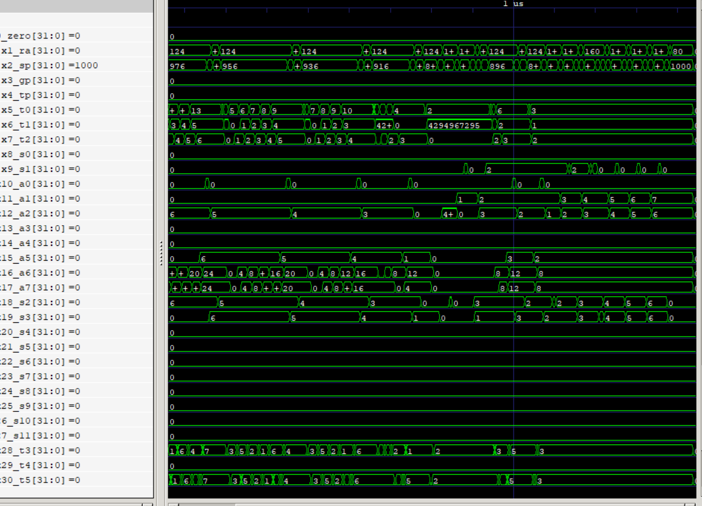
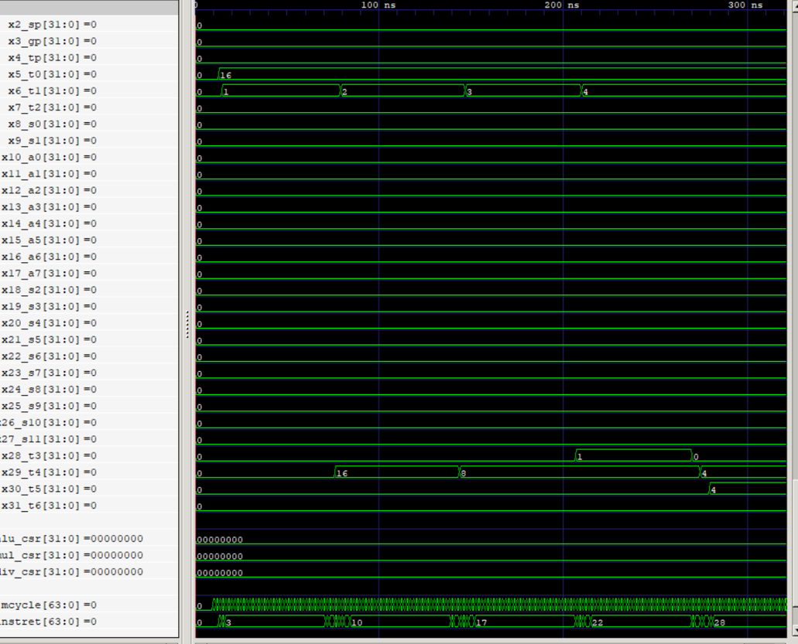

### Saba Pirahmadian
### Sorin YousefNia


### Quick Sort
QuickSort is a way of Sorting data, Which you can tell by the name.
 THe Algorhitm in this method:
Assuming we have some integers.
We also have two indexes: Current Index & Swap Marker
the furthest integer from the start is the Pivot Value, AKA, PV.
in this alghorithm, we compare the starting Vlaue With PV.
in the first attempt, If our current state value is bigger than PV, The Current Index sums by 1 and passes.
And If It is equal or smaller than PV, Swap Marker sums by 1; We continue by comparing the place of Current Index and Swap Marker. If they are in the same spot(Have the same Value),
The Current Index sums by 1 and passes. but if the Current Index is ahead(has more value) comparing to Swap MArker, We Change The Place Of their Values.
We continue till we finish and the Current Index Reaches the final, then gudging by the PV's place, We divide our data into to parts:
1 elements smaller than PV
2 elements larger than PV
Now we sort Each Half seperately and it goes on and on till All the data is stablized

```
#input assignment
    addi t0, x0, 3
    sw t0, 0(a0) 
    addi t0, x0, 5
    sw t0, 4(a0)
    addi t0, x0, 2
    sw t0, 8(a0)
    addi t0, x0, 1
    sw t0, 12(a0)
    addi t0, x0, 6
    sw t0, 16(a0)
    addi t0, x0, 4
    sw t0, 20(a0)
    addi t0, x0, 7
    sw t0, 24(a0)
```
this line of code get the input)(i gave [3, 5, 2, 1, 6, 4, 7] as input) and put it in the stack pointer, then the next line of code proceed to run the quick sort function

quick sort function
The quick_sort function is a recursive implementation of the quicksort algorithm.It takes three arguments: the array pointer (a1), the low index (a2), and the high index (a3).The function recursively sorts the array between the specified indices.
The pivot element is chosen, and the array is partitioned into two subarrays.The function then recursively calls itself on both subarrays.

partition
the partition function selects a pivot element and rearranges the array elements such that elements less than the pivot are on one side, and elements greater than the pivot are on the other side.
 
loop
this function find the pivot point position in the array given to it

two functions currr_element_gte_pivot and st_gt_end check and make the arrays which pass to loop

loop_DONE
check if the pivot finall position is found

end 
`ebreak1 the program


ps:I found this code on the internet, it took a whole day, I hope to get some of the point at least
source = `https://github.com/cgyurgyik/riscv-assembly/blob/master/quicksort.s`

### Integer Square Root
- `t0` is the input number user which user enter, int this code we set it to 16 to test the code.
- `t1` is the index number which we test to from 1 to input number in the following code.
#### Code Logic
- `main` in this section we assigned input which user can change and also set index to 1.
- `sqrt_loop` in this section we check if the index is lower than input then we proceed the following steps, else we end the code and we don't do anything further.
- `sqrt_check` in the section we check if ouput is multiple of index, if it is then we are one step closer to final result so we gp to `sqrt_check2` , else  index++.
- `sqrt_check2`, in this section we check if `index * index = input`,if it is then we find the answer, else index++;
- `sqrt_done`, we put the answer in `t5` and end the program

#### GTKWave
